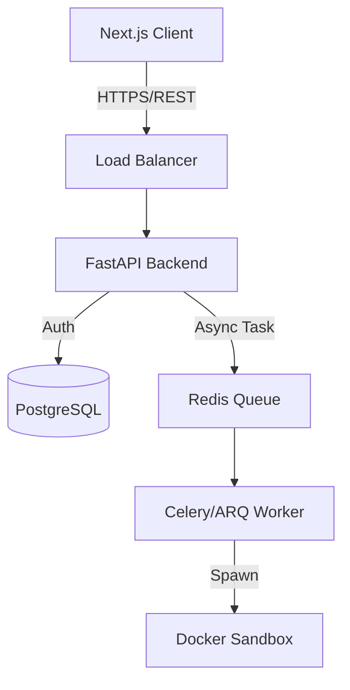

# Product Requirement Document (PRD): Practice Room Platform

## 1. Executive Summary

### 1.1 Vision
To build a high-performance, secure, and scalable **Python Practice Platform** that bridges the gap between theoretical knowledge and practical application. The platform will provide a friction-free coding environment with real-time execution, instant feedback, and gamified progress tracking.

### 1.2 Business Objectives
*   **User Engagement:** Achieve a daily active user (DAU) retention rate of >20% through streak mechanics and seamless UX.
*   **Scalability:** Support 100+ concurrent code executions without performance degradation.
*   **Security:** Ensure 100% isolation of user-submitted code to prevent infrastructure compromise.

---

## 2. User Personas & User Stories

### 2.1 The Learner (Primary)
**Goal:** Master Python features through consistent practice.
*   **Story:** As a learner, I want to filter questions by difficulty so I can practice at my own pace.
*   **Story:** As a learner, I want immediate feedback on my code specifically highlighting *where* it failed, not just *that* it failed.
*   **Story:** As a learner, I want to track my "streak" to stay motivated.

### 2.2 The Administrator (Internal)
**Goal:** Maintain platform health and content quality.
*   **Story:** As an admin, I want to create/edit questions with markdown support and hidden test cases.
*   **Story:** As an admin, I want to view execution logs to identify potential abuse or errors in the sandbox.

---

## 3. Technical Architecture Overview

### 3.1 High-Level Design
The system follows a **Microservices-ready Monolithic** architecture. While currently a monolith for valid MVP velocity, module boundaries are strictly enforced to allow for future extraction of the "Execution Engine".



### 3.2 Technology Stack
*   **Frontend:**
    *   **Framework:** Next.js 15 (App Router)
    *   **Language:** TypeScript
    *   **Styling:** Tailwind CSS + Shadcn UI (Radix Primitives)
    *   **Editor:** Monaco Editor (`@monaco-editor/react`)
    *   **State Management:** React Query (Server State) + Zustand (Client State)
*   **Backend:**
    *   **Framework:** FastAPI (Python 3.12+)
    *   **ORM:** SQLModel (Pydantic + SQLAlchemy Core)
    *   **Task Queue:** ARQ or Celery (Redis backed) for offloading code execution.
    *   **Validation:** Pydantic V2
*   **Infrastructure:**
    *   **Database:** PostgreSQL 16 (Production) / SQLite (Local Dev)
    *   **Containerization:** Docker Desktop / Docker Compose
    *   **Reverse Proxy:** Nginx (Production)

---

## 4. Functional Requirements

### 4.1 Authentication & Authorization
*   **[FR-01]** Secure Registration/Login via Email & Password.
*   **[FR-02]** JWT-based stateless authentication. Token rotation (Access + Refresh tokens).
*   **[FR-03]** RBAC (Role-Based Access Control) with at least `USER` and `ADMIN` roles.

### 4.2 Code Execution Engine (The Core)
*   **[FR-04] Secure Sandboxing:** All user code **MUST** run in isolated Docker containers.
    *   **Network:** `none` (No internet access).
    *   **PIDs:** Limited.
    *   **Memory:** Hard limit 128MB.
    *   **CPU:** Hard limit 0.5 vCPU.
    *   **Filesystem:** Read-only root (except `/tmp`).
*   **[FR-05] Timeout Enforcement:** Execution must strictly timeout after 5 seconds to prevent infinite loops.
*   **[FR-06] Input/Output Validation:** Compare `stdout` against expected output for multiple test cases.

### 4.3 Question Management
*   **[FR-07]** Rich-text problem descriptions (Markdown + LaTeX support).
*   **[FR-08]** Multi-file support (main.py + solution.py + tests.py).

### 4.4 Gamification
*   **[FR-09] Daily Streak:** Logic to track consecutive activity. timezone-aware.
*   **[FR-10] Submission History:** Store code snapshots for every attempt.

---

## 5. Database Schema (Draft)

### `users`
*   `id`: UUID (PK)
*   `email`: String (Unique, Indexed)
*   `hashed_password`: String
*   `role`: Enum (ADMIN, USER)
*   `created_at`: Datetime

### `questions`
*   `id`: UUID (PK)
*   `slug`: String (Unique, URL friendly)
*   `title`: String
*   `content`: Text (Markdown)
*   `difficulty`: Enum (EASY, MEDIUM, HARD)
*   `starter_code`: Text
*   `is_published`: Boolean

### `test_cases`
*   `id`: UUID (PK)
*   `question_id`: UUID (FK)
*   `input_data`: Text
*   `expected_output`: Text
*   `is_hidden`: Boolean (Anti-cheat)

### `submissions`
*   `id`: UUID (PK)
*   `user_id`: UUID (FK)
*   `question_id`: UUID (FK)
*   `code`: Text
*   `status`: Enum (PENDING, ACCEPTED, WRONG_ANSWER, RUNTIME_ERROR, TIME_LIMIT_EXCEEDED)
*   `execution_time_ms`: Integer
*   `created_at`: Datetime

---

## 6. API Guidelines (RESTful)

*   **Standard Response Format:**
    ```json
    {
      "data": { ... },
      "error": null,
      "meta": { "pagination": ... }
    }
    ```
*   **Error Handling:** Use HTTP status codes correctly (400 for validation, 401 for auth, 403 for permission, 404 for not found, 429 for rate limit).
*   **Versioning:** URI Versioning `/api/v1/...`.

---

## 7. Implementation Roadmap

### Phase 1: The Foundation (Week 1)
*   [ ] Setup Monorepo (Frontend + Backend).
*   [ ] Configure Docker environment & Docker Compose.
*   [ ] Implement Auth (Register/Login/Me) Backend + Frontend.

### Phase 2: The Core (Week 2)
*   [ ] Build "Execution Worker" service (Redis + Docker wrapper).
*   [ ] Implement Question CRUD API.
*   [ ] Develop "Code Editor" component with submission flow.

### Phase 3: Validation & Refinement (Week 3)
*   [ ] Implement Test Case runner logic.
*   [ ] Add "Streak" calculation logic.
*   [ ] UI Polish (Dark mode, Loading states, Toast notifications).

### Phase 4: Production Readiness (Week 4)
*   [ ] Load Testing (Locust/k6).
*   [ ] Security Audit (OWASP ZAP).
*   [ ] CI/CD Pipeline setup.

---

## 8. Security & Risks

*   **Remote Code Execution (RCE):** This is a feature, but also the biggest risk. Strictly validate Docker configurations. Never run containers as root.
*   **Denial of Service (DoS):** Implementation of rate limiting on the `/execute` endpoint is mandatory.
*   **Data Leakage:** Ensure test cases (especially hidden ones) are never sent to the client.

